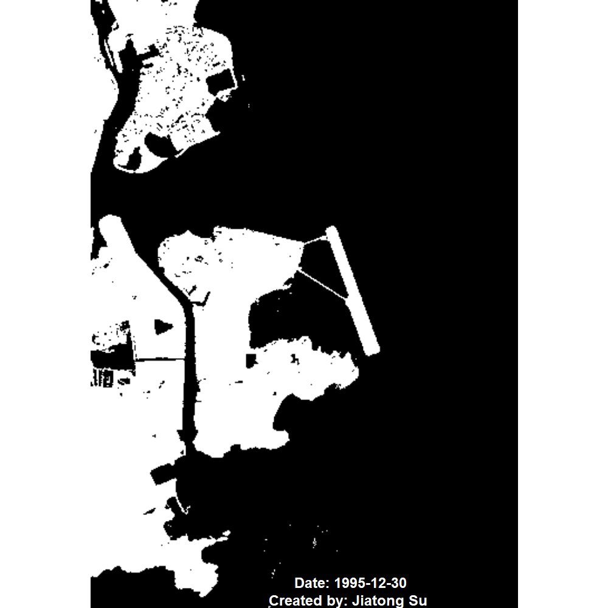

# Macau Land Reclamation Time-Series Analysis (1990–2025)

This project visualizes **35 years of land reclamation in Macau** using Landsat satellite imagery.  
By applying water–land classification and generating a temporal GIF, the analysis highlights how Macau’s coastline and urban footprint expanded between **1990 and 2025**.

本研究運用 Landsat 影像呈現並分析澳門過去三十多年來的土地擴張。

## 🌍 Overview

Macau is one of the world's most land-scarce cities.  
Reclamation has played a central role in its urban development—from the early expansions of the Macau Peninsula, to the creation of **Cotai**, and the more recent construction of **New Urban Zones A/B/C** and the **Hong Kong–Zhuhai–Macau Bridge artificial island**.

This project demonstrates:

- Multi-decade **Landsat time-series processing**  
- Water–land extraction using index-based thresholding  
- Change detection through binary raster comparison  
- A clean visual presentation of Macau’s reclamation phases

## 🛰 Data Source

- **Landsat 5 / 8** Surface Reflectance imagery  
- Downloaded from [USGS EarthExplorer](https://earthexplorer.usgs.gov/
)  
- Spatial resolution: **30m**  
- Study years: **1990, 1995, 2000, 2005, 2010, 2015, 2020, 2025**

- Macau boundary: The macau_geojson was downloaded from the [Map of Macau and GIS data — download OSM vector layers](https://geo2day.com/asia/china/macau.html). 

#### Other Macau GIS dataset

[OpenStreetMap-Macau](https://download.geofabrik.de/asia/china/macau.html)

 For more detail information about Landsat spectral bands, refer to [Spectral Bands and Applications - NASA Science](https://www.usgs.gov/faqs/what-are-band-designations-landsat-satellites).

## 🔧 Methods

### 1. Preprocessing
- Crop to Macau AOI  
- Align rasters to consistent extent & resolution  
- Normalize reflectance values  
- Apply cloud masking where necessary

### 2. Water–Land Classification
Using index thresholding (e.g., NDWI) to extract coastline and reclaimed land.

*NDWI = (Green – NIR)/(Green + NIR)*

### 3. Temporal Visualization
Each year’s binary land mask is exported and combined into a **time-series GIF** to show urban expansion.

For more information, please preview the full [R Markdown HTML](https://sujiatong.github.io/macau-reclamation-timeseries/rmd/landsat__mo_gif.html) file included in this repository.

## 📽 Results — Time-Series GIF

### Landsat Macau GIF

This Landsat time series GIF display the significant growth of Macau’s land area, highlighting progression of reclamation from 1990 to 2025.

此動畫呈現澳門自 1990 至 2025 年間因填海而大幅擴張的陸地面積變化。

### Flase Color
This false-color land-change visualization highlights Macau’s rapid coastal expansion from 2000 to 2025 using multi-temporal Landsat imagery. Red areas represent newly reclaimed land between 2010–2025, yellow between 2000–2010, and white denotes stable land present across all three period.

#### GIF
The false-color time-series highlights spatial change across years.
Red pixels represent land newly gained through reclamation relative to earlier baselines, whereas white pixels denote stable land areas that have remained since 1995.

## 📌 Key Findings

- Macau’s fastest land growth occurred between **1990–2005**.  
- The **Cotai** area transformed from open water to a continuous landmass.  
- Reclamation continued into the 2010s with major planned urban zones.  
- Remote sensing provides a powerful lens to visualize long-term coastal change.

## ✨ Author / 作者

Created by **Jiatong Su**  
本專案由 **Jiatong Su 蘇嘉烔** 製作。  

## 📬 Contact
- Email: sujiatong23@gmail.com  

## ⭐ Notes  

This project was created for self-study and visualization purposes using open satellite imagery.  

It aims to provide a clear, accessible representation of Macau’s long-term reclamation process.

# Reference
[Using Normalized Difference Water Index (NDWI)](https://storymaps.arcgis.com/stories/f94f50c05fa24667848b4b51af614935)

[城市格局演變與城市規劃制度研析](https://www.heritage.mo/uploads/ueditor/file/20250109/1736412868620955.pdf?utm_source=chatgpt.com)

[*Estrada do Istmo* (路氹連貫公路)](https://zh.wikipedia.org/zh-mo/%E8%B7%AF%E6%B0%B9%E9%80%A3%E8%B2%AB%E5%85%AC%E8%B7%AF)

[澳門填海造地](https://zh.wikipedia.org/zh-hk/%E6%BE%B3%E9%96%80%E5%A1%AB%E6%B5%B7%E9%80%A0%E5%9C%B0)

[路氹城填海計劃](https://www.dsop.gov.mo/construction/4/52/)

[新城填海區規劃](https://www.dsop.gov.mo/construction/2/39/)

[澳門．填出來的版圖與命脈](https://memorymacau.blogspot.com/2014/05/blog-post.html)

[Evolution process of land reclamation in Macao and its impact on economy and ecology](
https://www.researchgate.net/publication/363356538_Evolution_process_of_land_reclamation_in_Macao_and_its_impact_on_economy_and_ecology)

[Spectral Bands and Applications - NASA Science](https://www.usgs.gov/faqs/what-are-band-designations-landsat-satellites).