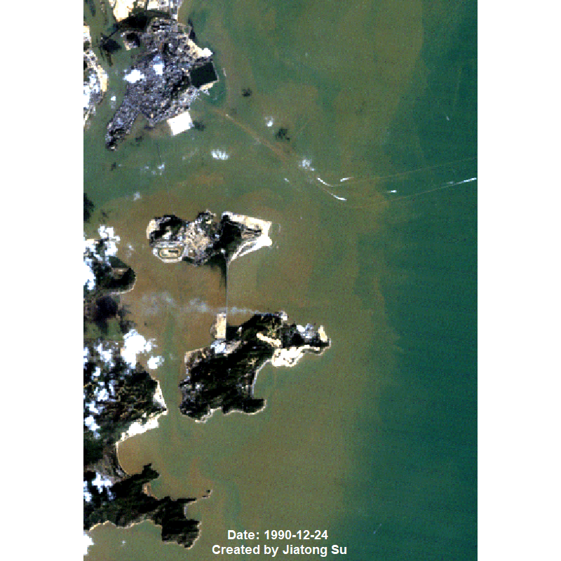
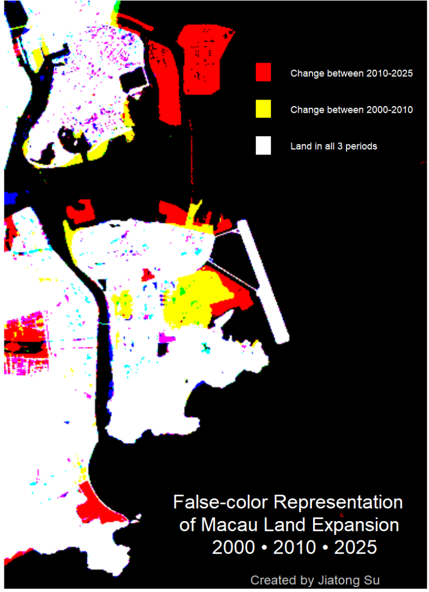

# Macau GIS dataset

https://download.geofabrik.de/asia/china/macau.html

https://geo2day.com/asia/china/macau.html

Landsat: https://earthexplorer.usgs.gov/

HINT: https://www.usgs.gov/faqs/what-are-band-designations-landsat-satellites

# Landsat Macau GIF

This Landsat time series GIF display the significant growth of Macau’s land area, highlighting progression of reclamation from 1990 to 2025.

此動畫呈現澳門自 1990 至 2025 年間因填海而大幅擴張的陸地面積變化。

## Flase Color
This false-color composite highlights Macau’s land reclamation between 2000, 2010, and 2025. Red indicates newly reclaimed land; yellow shows mid-period expansion.

